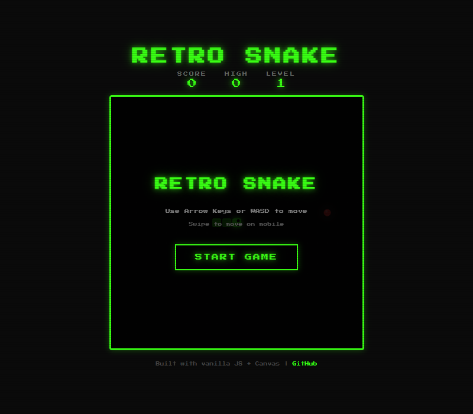
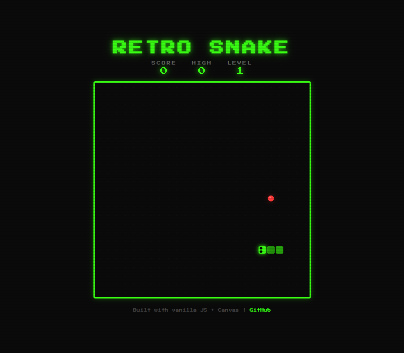

# 🐍 Retro Snake

A classic Snake arcade game with retro CRT aesthetics, particle effects, power-ups, and procedural sound — built entirely with **vanilla JavaScript** and **HTML5 Canvas**. No frameworks, no dependencies.

| Menu | Gameplay |
|:----:|:--------:|
|  |  |

## 🎮 Play Now

**[▶ Play Retro Snake](https://josedasilva11.github.io/retro-snake/)**

## ✨ Features

- **Retro CRT Aesthetic** — Scanline overlay, neon green glow, pixel font
- **Smooth Gameplay** — Responsive controls with WASD, Arrow Keys, or touch/swipe on mobile
- **Particle Effects** — Explosions on food pickup and death
- **Floating Score Popups** — Visual feedback on every pickup
- **Bonus Star Power-ups** — Random star items worth 3x points with a timer bar
- **Progressive Difficulty** — Speed increases as you level up
- **Procedural Sound Effects** — Retro 8-bit sounds generated with Web Audio API (no audio files needed)
- **High Score Persistence** — Best score saved to localStorage
- **Fully Responsive** — Playable on desktop and mobile with on-screen D-pad
- **Zero Dependencies** — Pure HTML, CSS, and JavaScript

## 🕹️ Controls

| Input | Action |
|-------|--------|
| `↑` `↓` `←` `→` | Move snake |
| `W` `A` `S` `D` | Move snake (alternative) |
| Swipe | Move snake (mobile) |
| D-pad buttons | Move snake (mobile) |

## 🏗️ Tech Stack

- **HTML5 Canvas** — Game rendering
- **Vanilla JavaScript** — Game logic, no frameworks
- **CSS3** — CRT effects, animations, responsive layout
- **Web Audio API** — Procedural retro sound effects
- **localStorage** — High score persistence

## 📁 Project Structure

```
retro-snake/
├── index.html    # Game page with overlay UI
├── style.css     # Retro CRT styling & responsive layout
├── game.js       # Complete game engine (~500 lines)
└── README.md
```

## 🚀 Run Locally

No build step needed — just open `index.html` in any modern browser.

```bash
# Clone the repo
git clone https://github.com/josedasilva11/retro-snake.git
cd retro-snake

# Option 1: Open directly
open index.html

# Option 2: Use a local server
npx serve .
```

## 🎯 Game Mechanics

- **Scoring**: Regular food = 10 pts, Bonus star = 30 pts
- **Levels**: Every 50 points increases the level and speed
- **Bonus items**: 15% chance to spawn after eating food, disappear after a timer
- **Game Over**: Hit a wall or yourself

## 📄 License

MIT License — feel free to fork, modify, and use however you like.

---

Built by [José Pedro Silva](https://github.com/josedasilva11)
